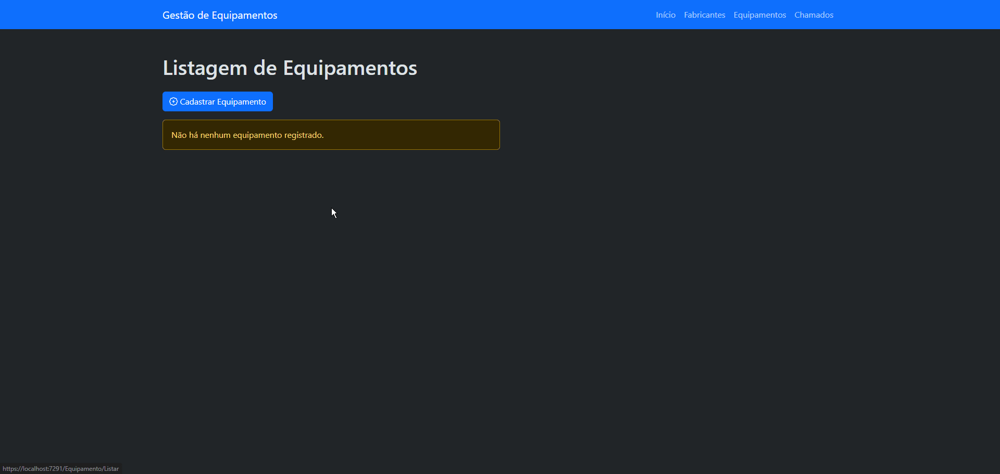
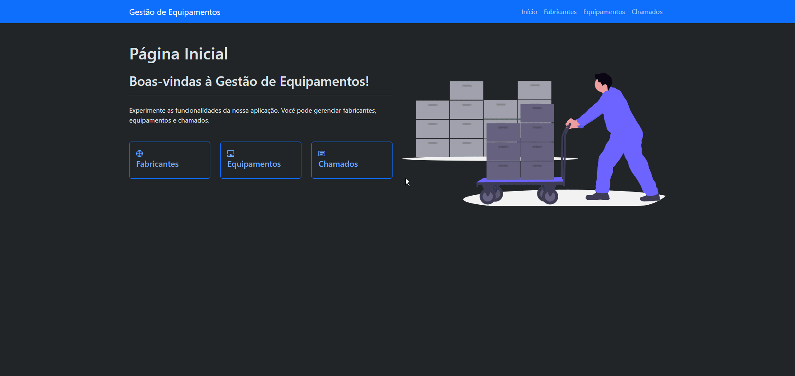

# Gestão de Equipamentos

Sistema web para gerenciar fabricantes, equipamentos e chamados de uma organização. Permite cadastrar equipamentos vinculados aos seus fabricantes e registrar chamados relacionados a cada equipamento.

Os dados são persistidos em um arquivo JSON local, então tudo que é cadastrado continua disponível na próxima vez que a aplicação for aberta.

Desenvolvido durante o curso Backend da [Academia do Programador](https://www.academiadoprogramador.net/) 2026.

---

## Como executar

```bash
dotnet run --project GestaoDeEquipamentos.WebApplication
```

Requer o **.NET 10.0 SDK**.

---

## Módulos

### 1. Fabricantes

Cadastro completo de fabricantes de equipamentos: registrar, visualizar, editar e excluir.

- Nome entre 2 e 100 caracteres
- E-mail obrigatório e em formato válido
- Telefone no formato `(XX) XXXXX-XXXX`


---

### 2. Equipamentos

Cadastro completo de equipamentos, cada um vinculado a um fabricante.

- Nome entre 6 e 100 caracteres
- Preço de aquisição maior que zero
- Data de fabricação obrigatória
- Fabricante obrigatório



---

### 3. Chamados

Cadastro completo de chamados relacionados aos equipamentos cadastrados.

- Título entre 6 e 100 caracteres
- Descrição entre 6 e 100 caracteres
- Data de abertura obrigatória
- Equipamento obrigatório



---

## Onde os dados ficam

O arquivo `dados.json` é gravado em:

```text
%LOCALAPPDATA%\GestaoDeEquipamentos-Backend\dados.json
```

Apagar esse arquivo zera os dados cadastrados no sistema.
